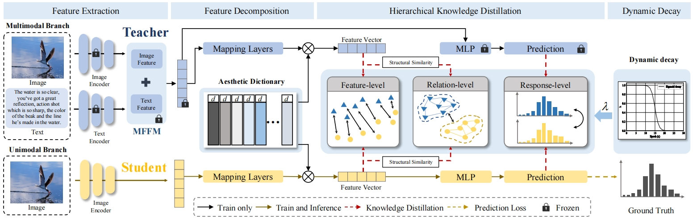

# HKD-IAA (The code is coming soon)

## 🔗 Framework
Cross-Modal Hierarchical Knowledge Distillation for Image Aesthetics Assessment (TMM2024)


## 📃 Dependencies
- pytorch
- torchvision
- tqdm

## ⏬ Download
- You can download the pre-trained Multimodal teacher model at: [Baidu Cloud](https:). (password: HKDIAA), or [Google Drive](https:)

## 📂 Dataset and Preprocessing
- You can download the AVA database at here: [AVA](https://github.com/imfing/ava_downloader)
- Methods for cleaning user comments can be found here：[Clean text](https://github.com/V-Sense/Aesthetic-Image-Captioning-ICCVW-2019)

## 📉 Training
```
python main.py
```

## ✨ Statement
This project is for research purpose only, please contact us for the licence of commercial use. For any other questions please contact 1010075746@qq.com or shaofeng@nbu.edu.cn

## 🔍 Citation
If our criteria are helpful, please consider citing the following papers.
```
@article{HKD-IAA,
  title={Cross-Modal Hierarchical Knowledge Distillation for Image Aesthetics Assessment},
  author={Hangwei Chen, Feng Shao, Weiyi Jing, Huizhi Wang, Qiuping Jinag},
  journal={Transactions on Multimedia},
  year={2024},
}
```


